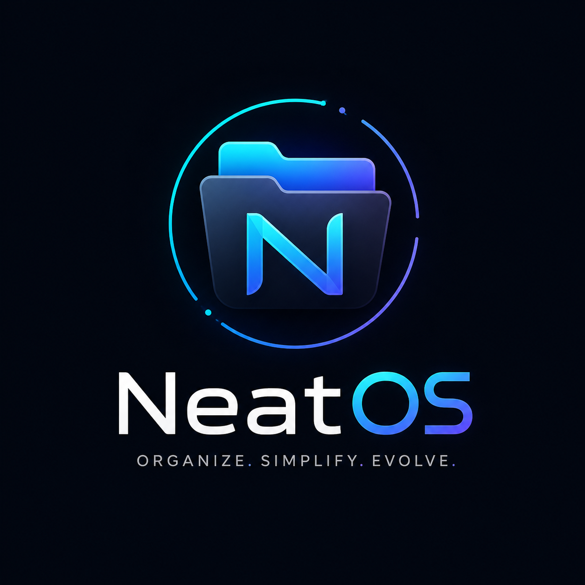

<div align="center">
  
  <br/>
  <h1>NeatOS</h1>
  <p><strong>Smart, adaptive, and beautiful file organization system.</strong></p>
  
  <p>
    <a href="https://github.com/danielSmage/NeatOS/actions"></a>
    <a href="#license"></a>
    <a href="https://electronjs.org"></a>
  </p>
</div>

<br/>

## ✨ Introduction

**NeatOS** is a next-generation desktop application designed to eliminate digital clutter. By leveraging intelligent pattern recognition, advanced algorithms, and a sleek modern UI (inspired by Vercel and Notion), it automatically organizes any folder into well-structured categories with a single click.

## 🚀 Features

- 🧠 **Intelligent Pattern Matching**: Detects contextual filenames (e.g., `screenshot`, `invoice`, `installer`) to accurately sort files.
- 📂 **Auto-Categorization**: Organizes by standard formats (Images, Videos, Documents, Music, Executables, and ZIPs).
- 🔄 **Real-Time Watcher**: Runs silently in the background, keeping watched folders perfectly organized as new files arrive.
- 🎨 **Glassmorphism UI**: A stunning, ultra-minimalist interface with seamless Light/Dark mode transitions.
- 🛡️ **Fail-Safe Mechanism**: Guarantees zero data loss with intelligent auto-renaming, avoiding file overrides.
- ⏪ **Action History & Undo**: Provides a complete log of organized files with a 1-click Undo function.

## 🛠️ Architecture

NeatOS is built using an enterprise-grade modular architecture:

```text
src/
├── core/
│   └── organizer.js    # Core logic (file movement, rules, intelligence)
├── services/
│   ├── store.js        # Data persistence (Electron Store)
│   └── watcher.js      # Background file monitoring (Chokidar)
```

## 📋 Prerequisites

Before you begin, ensure you have met the following requirements:
* You have installed **[Node.js](https://nodejs.org/en/)** (v18.0.0 or higher) and **npm**.
* You have a basic understanding of terminal commands.

## 📦 Installation & Usage

1. **Clone the repository:**

   ```bash
   git clone https://github.com/danielSmage/NeatOS.git
   cd NeatOS
   ```

2. **Install dependencies:**

   ```bash
   npm install
   ```

3. **Start the application (Development):**

   ```bash
   npm start
   ```

4. **Build the executable:**
   ```bash
   npm run build
   ```
   > The generated executable and standalone folder will be located in the `dist_standalone/` directory.

## 🧰 Core Technologies & Dependencies

NeatOS is powered by a carefully curated stack to ensure maximum performance and security:
- **[Electron](https://www.electronjs.org/)** (`^30.0.0`) - The core framework for cross-platform desktop functionality.
- **[Chokidar](https://github.com/paulmillr/chokidar)** (`^3.6.0`) - High-performance file system watcher for real-time background automation.
- **[Electron-Store](https://github.com/sindresorhus/electron-store)** (`^8.1.0`) - Simple data persistence for saving intelligent rules and organization history.
- **[Lucide](https://lucide.dev/)** - Beautiful, consistent iconography for the UI.
- **[ESLint](https://eslint.org/) & [Prettier](https://prettier.io/)** - For enforcing strict code quality and formatting standards.

## 🤝 Contributing

Contributions, issues, and feature requests are welcome! Feel free to check the [issues page](https://github.com/danielSmage/NeatOS/issues).

## 📜 License

This project is [MIT](https://choosealicense.com/licenses/mit/) licensed.
